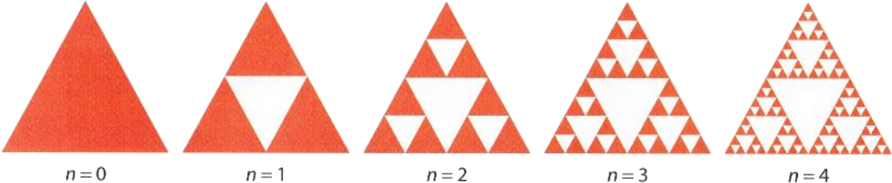

# Nombre de triangles

- Combien de triangles compose la figure ...
  - $n=1$
  - $n=2$
  - $n=3$
- Existe-t-il une formule pour dénombrer ce nombre de triangles ?  

---

- Combien de triangles compose la figure ...
  - $n=1\qquad\qquad \rarr \boxed{3}$ triangles
  - $n=2\qquad\qquad \rarr \boxed{9}$ triangles
  - $n=3\qquad\qquad \rarr \boxed{27}$ triangles
- Existe-t-il une formule pour dénombrer ce nombre de triangles ?  

$$\boxed{N_{\text{triangles}}=3^n}$$

