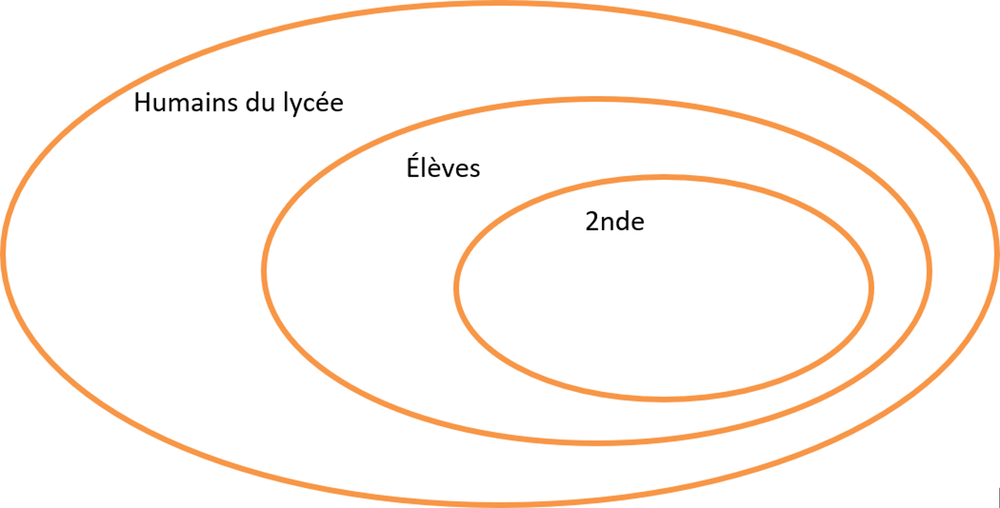
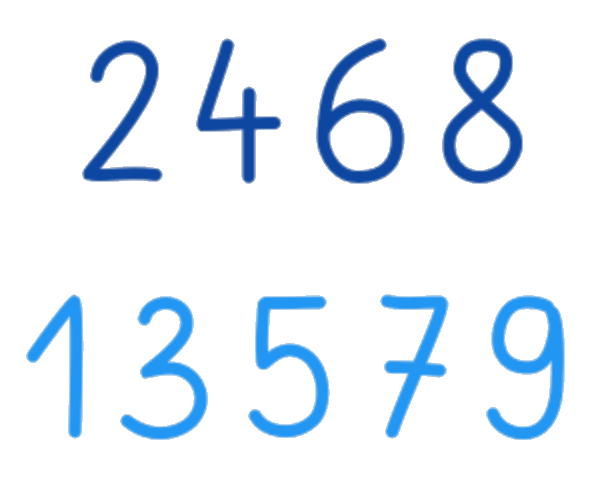
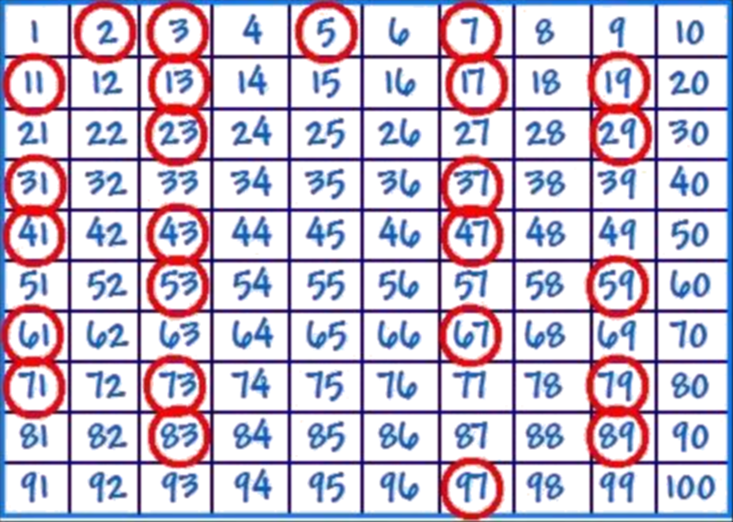
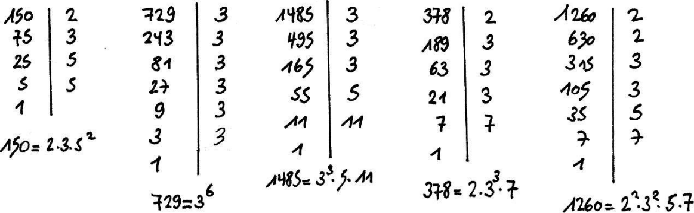

# Dérivation (1) : Nombre dérivé

---

## Limite en zéro d'une fonction

**Exemple :**

Soit $f$ définie sur $\left]-\infty;0\right[\cup\left]0 ; +\infty\right[$ par $f(x)=\dfrac{((x+1)^2-1)}{x}$.

L'image de $0$ par $f$ n'existe pas.

---

On s'intéresse cependant aux valeurs de $f(x)$ lorsque $x$ se **rapproche** de $0$.

$x$ | $-0,5$ | $-0,1$ | $-0,01$ | $-0,001$ | $\ldots$ | $0,001$ | $0,01$ | $0,1$ | $0,5$
:---:|:---:|:---:|:---:|:---:|:---:|:---:|:---:|:---:|:---:
$f(x)$ | $1,5$ | $1,9$ | $1,99$ | $1,999$ | $?$ | $2,001$ | $2,01$ | $2,1$ | $2,5$

On constate que $f(x)$ se **rapproche** de $2$ lorsque $x$ se **rapproche** de $0$.

On dit que la **limite** de $f$ lorsque $x$ **tend vers** $0$ est égale à $2$ et on note :

$$\lim\limits_{x\to 0}f(x)=2$$

---

**Exemple :**

Soit $g$ définie sur $\left]-\infty;0\right[\cup\left]0;+\infty\right[$ par $g(x)=\dfrac{1}{x^2}$

A l'aide de la calculatrice, on constate que $g(x)$ devient de plus en plus grand lorsque $x$ se **rapproche** de $0$.

On dit que la **limite** de $g$ lorsque $x$ tend vers $0$ est égale à $+\infty$ et on note :

$$\lim\limits_{x\to 0}g(x)=+\infty$$

---

**Définition :**

On dit que $f(x)$ a pour limite $L$ lorsque $x$ **tend vers** $0$ si les valeurs de $f(x)$ peuvent être **aussi proche de $L$ que l'on veut** pourvu que $x$ soit suffisamment proche de $0$.

On note :
$$\lim\limits_{x\to 0}f(x)=L$$

et on lit : "La **limite** de $f(x)$ lorsque $x$ **tend vers** $0$ est égale à $L$".

---

## Nombre dérivé

### Rappel : Pente d'une droite

Soit $f$ définie sur $I$. Soit deux réels $a$ et $b$ appartenant à $I$ tels que $a<b$.

Soit $A$ et $B$ deux points de $\mathscr{C_f}$ d'abscisses respectives $a$ et $b$.

La **pente** (ou le **coefficient directeur**) de la droite $(AB)$ est égal à :

$$\dfrac{f(b)-f(a)}{b-a}$$

---

### Fonction dérivable

Soit $f$ définie sur $I$. Soit un réel $a\in I$.

Soit $A$ et $M$ deux points de $\mathscr{C_f}$ d'abscisses respectives $(a)$ et $(a+h)$, avec $h\neq 0$.

La pente de la droite $(AM)$ est égale à :

$$\dfrac{f(a+h)-f(a)}{h}$$

---

Lorsque le point $M$ se rapproche du point $A$, la pente de la droite $(AM)$ est égale à la **limite** de $\left(\dfrac{f(a+h)-f(a)}{h}\right)$ lorsque $h$ tend vers $0$.

Cette **pente** s'appelle le **nombre dérivé** de $f$ en $a$ et se note $f'(a)$.

---

**Définition :**

On dit que la fonction $f$ est dérivable en $a$ s'il existe un nombre réel $L$, tel que :

$$\lim\limits_{h\to 0}\left(\dfrac{f(a+h)-f(a)}{h}\right) = L$$

$L$ est appelé **le nombre dérivé** de $f$ en $a$ et se note $f'(a)$

$$\boxed{f'(a)=\lim\limits_{h\to 0}\left(\dfrac{f(a+h)-f(a)}{h}\right)}$$

---

#### Méthode : Démontrer qu'une fonction est dérivable

Soit $f$ définie sur $\mathbb{R}$ par $f(x)=x^2+2x-3$.

Pour démontrer que $f$ est dérivable en $x=2$, calculons $\left(\frac{f(2+h)-f(2)}{h}\right)$  pour $h\neq 0$ :

$\begin{aligned}
\frac{f(2+h)-f(2)}{h}&=\frac{\left((2+h)^2+2(2+h)-3\right)-\left(2^2+2\times 2-3\right)}{h}\\
                     ~&=\frac{(4+4h+h^2+4+2h-3)-(5)}{h}\\
                     ~&=\frac{6h+h^2}{h}\\
                     ~&=\frac{h(6+h)}{h}\quad=6+h
\end{aligned}$

---

Donc

$$f'(2)=\lim\limits_{h\to 0}\left(\dfrac{f(2+h)-f(2)}{h}\right)  = \lim\limits_{h\to 0}(6+h)  = 6$$

On en déduit que $f$ est dérivable en $x=2$.

Le **nombre dérivé** de $f$ en $2$ vaut $6$ et on note : $f'(2)=6$

---

### Tangente à une courbe

Soit $f$ définie sur $I$ et dérivable en un nombre réel $a\in I$.

$f'(a)$ est le **nombre dérivé** de $f$ en $a$.

$A$ est un point d'abscisse $a$ appartenant à $\mathscr{C_f}$.

---

**Définition :**

La **tangente** à $\mathscr{C_f}$ au point $A$ est la droite passant par $A$ de pente le nombre dérivé $f'(a)$.

---

#### Méthode : Déterminer la pente d'une tangente à une courbe

Soit $f$ définie sur $\mathbb{R}$ par $\ldots$

$$f(x)=x^2+2x-3$$

$\ldots$ dérivable en $x=2$.

On a vu que le nombre dérivé de $f$ en $2$ vaut $6$ : $\quad f'(2)=6$.

Ainsi la tangente à $\mathscr{C_f}$ au point $A$ d'abscisse $2$ est la droite passant par $A$ et de **pente** $6$.

---

**Propriété :**

Une équation de la tangente à $\mathscr{C_f}$ en $A\left(a~;~f(a)\right)$ est :

$$\boxed{y=f'(a)(x-a)+f(a)}$$

---

**Démonstration au programme :**

La tangente a pour pente $f'(a)$ donc son équation est de la forme :

$y=f'(a)x+b\quad$ où $b$ est l'ordonnée à l'origine.

La tangente passe par le point $A\Big(a~;~f(a)\Big)$, donc :

$f(a)=f'(a)\times a+b\quad\Leftrightarrow\quad \color{blue}b=\Big(f(a)-f'(a)\times a\Big)\color{black}$

On en déduit que l'équation de la tangente peut s'écrire :

$y=f'(a)x+\color{blue}\Big(f(a)-f'(a)\times a\Big)\color{black}\quad\Leftrightarrow\quad y=f'(a)(x-a)+f(a)$

---

#### Méthode : Déterminer une équation d'une tangente à une courbe

Soit $f$ définie sur $\mathbb{R}$ par $f(x)=x^2+2x-3$

On a vu que $f'(2)=6$.

Donc son équation est de la forme :

$\begin{aligned}
              ~&~y=6(x-2)+f(2)\\
\Leftrightarrow&~y=6(x-2)+(2^2+2\times 2-3)\\
\Leftrightarrow&~y=6x-12+5\\
\Leftrightarrow&~y=6x-7
\end{aligned}$

Une équation de tangente à $\mathscr{C_f}$ au point $A$ d'abscisse $2$ est $~y=6x-7$.
