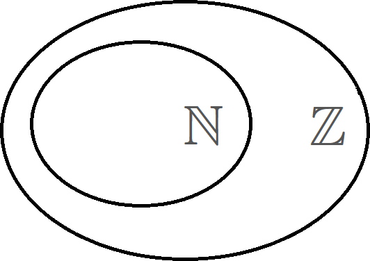
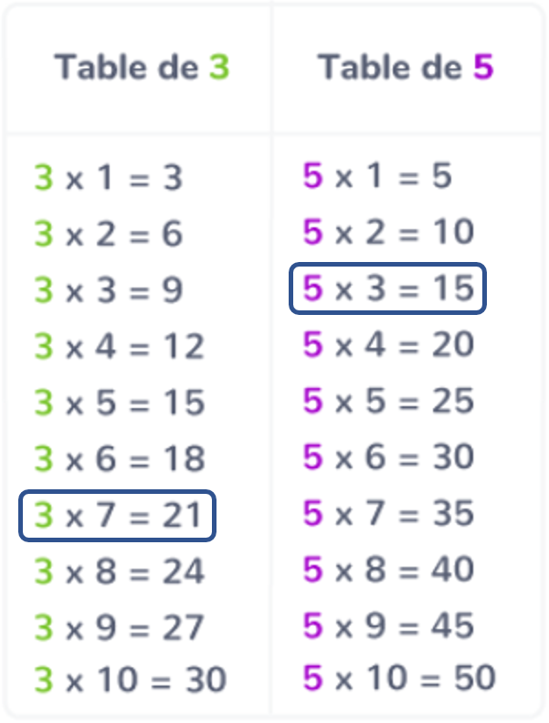

# Nombres entiers

## Entier naturel

**Def :** Un nombre **entier naturel** est un nombre entier qui est **positif**.

L'ensemble des nombres **entiers naturels** est noté $\N$.

$$\N=\left\{0 ;1 ;2 ;3 ;4 ;...\right\}$$

**Ex. :** $\qquad 4\in\N\qquad\qquad-2 \notin \N$

## Entier relatif

**Def :** Un nombre **entier relatif** est un nombre entier qui est **positif** ou **négatif**.

L'ensemble des nombres entiers relatifs est noté $\Z$.

$$\Z = \left\{...;-3 ; -2 ; -1 ; 0 ;1 ;2 ;3 ;...\right\}$$

**Ex. :** $\qquad 14\in\Z\qquad\qquad-4 \in \Z\qquad\qquad0.33\notin\Z$

{width=3cm}

# Multiples et diviseurs

## Multiple et diviseur

**Def :** Soit $a$ et $b$ deux entiers. On dit que $a$ est un **multiple** de $b$ s'il existe un **entier** $k$ tel que :

$$a = k\times b$$

On dit alors que $b$ est un **diviseur** de $a$.

> **Ex. :**
>
> - $15~$ est **multiple** de $~3~$ car $~15=5\times 3\qquad$ ...et $~3$ est un **diviseur** de $15$
>
> - $7~$ est un **diviseur** de $~21~$ car $~21=7\times 3\qquad$ ...et $~21$ est **multiple** de $7$
>
> - $5~$ n'est pas un **multiple** de $~17~$ car il n'existe pas **d'entier** $k$ tel que $17=k\times 5$

{width=4cm}

## Somme de deux multiples

**Prop :** La **somme** de deux multiples d'un entier $a$ est un multiple de $a$.

Ex. :

- $15$ est multiple de $3\quad(3\times 5=15)$
- $21$ est multiple de $3\quad(3\times 7=21)$

Donc $(15+21)=36$ est multiple de $3\quad(3\times 12=36)$

$~$

> **Démonstration**
>
> Soit $b$ et $c$ deux multiples de $a$.
>
> - $b$ est un multiple de $a$ donc il existe un **entier** $k_1$ tel que $b = a\times k_1$
> - $c$ est un multiple de $a$ donc il existe un **entier** $k_2$ tel que $c = a\times k_2$
>
> On a :
>
> $$\begin{aligned}(b + c)&= a\times k_1 +a\times k_2\\&=a\times (k_1 + k_2)\\&=a\times k\qquad\quad\text{où }~k=k_1+k_2\end{aligned}$$
>
> Or, $k = k_1+k_2$ est un entier car somme de deux entiers
>
> Donc $(b+c)=a\times k\quad$ avec $k$ entier $\Rightarrow (b + c)$ est donc un multiple de $a$.

> **Méthode : Résoudre un problème avec des multiples ou des diviseurs**
>
> Montrons que la somme de **trois entiers consécutifs** est un **multiple de 3**.
>
> Soit **trois entiers consécutifs** : $\textcolor{blue}{(n)}$, $\textcolor{red}{(n+1)}$ et $\textcolor{green!30!black!50}{(n+2)}$, où $n$ est un entier quelconque.
>
> Leur somme est :
>
> $$\begin{aligned}
> S&=\textcolor{blue}{n}+(\textcolor{red}{n+1})+(\textcolor{green!30!black!50}{n+2})\\
> &=n+n+1+n+2\\
> &= 3n+3\qquad=3(n + 1)
> \end{aligned}$$
>
> Soit $k$ l'entier tel que $k=n+1$.
>
> Donc $S = 3k$, avec $k$ entier $\quad\Rightarrow S$ est un multiple 3.

\newpage

# Nombres pairs, impairs

## Définition : pair / impair

- Un nombre **pair** est un multiple de 2.
- Un nombre **impair** est un nombre qui n'est pas pair.

{width=2cm}

> **Ex. :**
>
> - $34$, $68$, $9756786$ et $0$ sont des nombres **pairs**.
> - $567$, $871$ et $1$ sont des nombres **impairs**.

## Propriétés : pair / impair

**Prop :**

- Un nombre **pair** s'écrit sous la forme $~(2k)~$, avec $k$ entier.
- Un nombre **impair** s'écrit sous la forme $~(2k+1)~$, avec $k$ entier.

## Propriété : Carré d'un nombre impair

**Prop :** Le **carré** d'un nombre **impair** est **impair**.

> **Ex. :** $\quad 13^2=169\qquad 5^2=25\qquad ...$

$~$

> **Démonstration**
>
> Soit $a$ est un nombre **impair**.
>
> On peut l'écrire sous la forme $a=2k+1$, avec $k$ entier.
>
> On a :
>
> $$\begin{aligned}
> a^2&= (2k + 1)^2\\
>    &= 4k^2 +4k + 1\\
>    &= 2\textcolor{blue}{(2k^2 + 2k)} + 1\\
>    &= 2\textcolor{blue}{k'} + 1\qquad\text{avec}~\textcolor{blue}{k'=2k^2+2k}
> \end{aligned}$$
>
> $k'$ est **entier** car **somme** de **deux entiers**
>
> $a^2$ s'écrit sous la forme $~a^2=2k'+1\qquad\Rightarrow a^2$ est **impair**.

> **Méthode : Résoudre un problème avec des nombres pairs ou impairs**
>
> Montrons que le produit de deux entiers consécutifs est un nombre pair.
>
> Soit deux entiers consécutifs $~\textcolor{red}{n}~$ et $~\textcolor{blue}{n+1}~$.
>
> \underline{1\up{er} cas : $n$ pair}
>
> > Si $n$ est **pair**, alors il s'écrit sous la forme $~n=2k~$, avec $k$ entier.
> >
> > Alors le produit des deux entiers consécutifs s'écrit :
> >
> > $$\begin{aligned}\textcolor{red}{n}(\textcolor{blue}{n+1})&=2k(2k+1)\\&=2k_1\qquad\text{avec }~k_1 =k(2k+1)~\text{ entier}\end{aligned}$$
> >
> > Donc $n(n+1)$ est pair.
>
> \underline{2\up{ème} cas : $n$ impair}
>
> > Si $n$ est **impair**, alors il s'écrit sous la forme $~n = 2k+1~$, avec $k$ entier.
> >
> > Alors le produit des deux entiers consécutifs s'écrit :
> >
> > $$\begin{aligned}\textcolor{red}{n}(\textcolor{blue}{n+1})&=(2k+1)(2k+2)\\&=2(2k+1)(k+1)\\&=2k_2\qquad\text{avec }~k_2 =(2k+1)(k+1)~\text{ entier}\end{aligned}$$
> >
> > Donc $n(n+1)$ est pair.
>
> Dans tous les cas, le **produit** de **deux entiers consécutifs** est un **nombre pair**.

\newpage

# Nombres premiers

## Définition : Nombre premier

Un nombre est **premier** s'il possède exactement deux diviseurs qui sont $1$ et **lui-même**.

> **Ex. :** $\quad 2$, $3$, $5$, $7$, $11$, $13$, $17$, $19$, $23$, ...

{width=7cm}

Un très grand nombre premier :\par\noindent22 989 432 637 682 048 935 578 359 759 258 512 929 075 458 593 285 426 151 563 351 225 878 608 019 921 960 174 786 937 174 324 066 918 557 552 262 283 220 478 419 095 917 521 791 323 874 771 300 201 334 066 843 810 139 337 069 250 339 905 576 793 882 539 603 587 327 037 857 904 876 391 811 440 492 908 489 972 485 276 368 673 701 887

$\quad$

> **Rem. :**  Le nombre $1$ n'est pas premier car il n'a qu'**un seul diviseur**.

## Définition : Deux nombres premiers entre-eux

On dit que deux nombres sont **premiers entre eux** lorsque leur seul **diviseur** commun est $1$.

> **Ex. :**
> $20$ et $21$ sont **premier** entre-eux car :
>
> - $20=5\times 2\times 2\times \textcolor{red}{1}$
> - $21=7\times 3\times \textcolor{red}{1}$

## Propriété : Décomposition d'un nombre

Tout nombre **non premier** peut se décomposer en **produits** de facteurs premiers.

Cette décomposition est unique (à l'ordre des facteurs près).

> **Ex. :** Décomposons $420$ en facteurs premiers
> $$\begin{array}{l|r}420 & 2\\210 & 2\\105 & 3\\35 & 5\\7 & 7\\1 &~\end{array}$$
> Donc $\quad 420\quad=2\times 2\times 3\times 5\times 7\quad=2^2\times 3^1\times 5^1\times 7^1$

> **Ex. :** Décomposons $150$, $729$, $1485$, $378$ et $1260$ en facteurs premiers
>

\newpage

{width=18cm}

## Définition : Fraction irréductible

On dit qu'une fraction est **irréductible**, lorsque son **numérateur** et son **dénominateur** sont **premiers entre eux**.

$\quad$

> **Ex. :**
>
> - $\frac{7}{5}$ est irréductible
> - $\frac{21}{144}$ n'est pas irréductible car $\frac{21}{144}=\frac{7\times 3}{48\times 3}=\frac{7}{48}\qquad\Rightarrow\frac{7}{48}$ est irréductible.

> **Méthode : Rendre une fraction irréductible**
>
> Rendons irréductible la fraction $\dfrac{60}{126}$.
>
> Pour rendre une fraction irréductible, il faut décomposer son **numérateur** et son **dénominateur** en produits de **facteurs premiers**.
>
> $$\begin{array}{l|r}60 & 2\\30 & 2\\15 & 3\\5 & 5\\1 &~\end{array}
> \qquad\begin{array}{l|r}126 & 2\\63 & 3\\21 & 3\\7 & 7\\1 &~\end{array}$$
>
> On ainsi les décompositions de $60$ et $126$ :
>
> $$60 = 2\times 2\times 3\times 5\qquad 126 = 2\times 3\times 3\times 7$$

> On a :
>
> $$\frac{60}{126}\quad= \frac{\textcolor{red}{2} \times 2 \times \textcolor{red}{3} \times 5}{\textcolor{red}{2} \times 3 \times \textcolor{red}{3} \times 7}\quad= \frac{2 \times 5}{3 \times 7}\quad=\frac{10}{21}$$
>
> $10$ et $21$ sont **premiers entre eux**, donc:
>
> $\dfrac{10}{21}$ est la fraction irréductible égale à $\dfrac{60}{126}$
