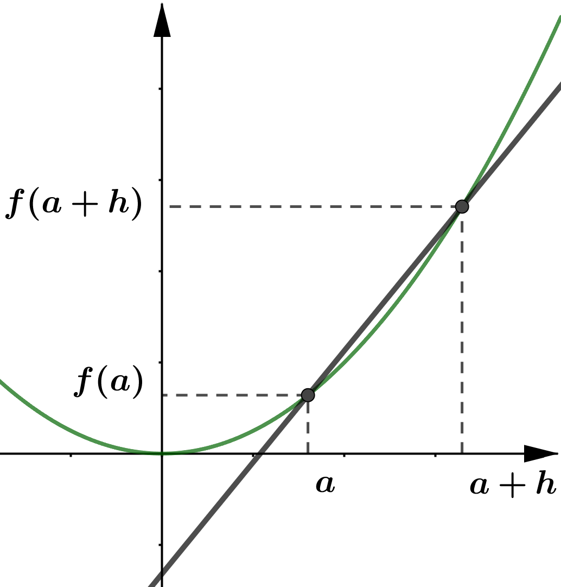
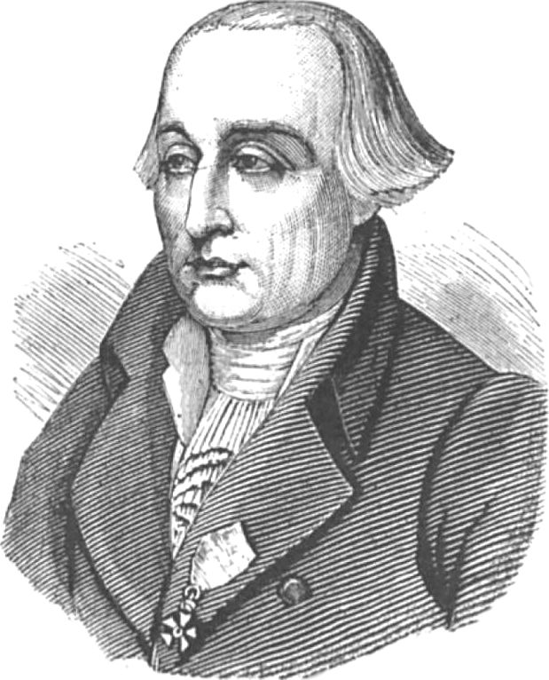
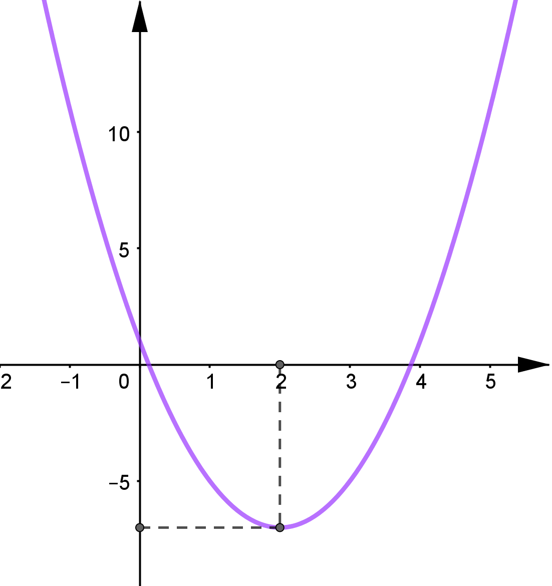

# Dérivées des fonctions usuelles

**Ex. :** Soit la fonction $f$ définie sur $\mathbb{R}$ par $f(x)=x^2$.

Démontrons que pour tout $x\in\mathbb{R}$ , on : $f'(x)=2x$.

Pour cela, calculons le **nombre dérivé** de $f$ en un nombre réel quelconque $a$.

{width=5cm}

Pour $h\neq 0$ :

$\begin{aligned}
\dfrac{f(a+h)-f(a)}{h}&=\dfrac{(a+h)^2-a^2}{h}\\
                     ~&=\dfrac{a^2+2ah+h^2-a^2}{h}\\
                     ~&=\dfrac{2ah+h^2}{h}\\
                     ~&=\dfrac{h\times\left(2a+h\right)}{h}\\
                     ~&=2a+h\\
\end{aligned}$

Or $\quad\lim\limits_{h\to 0}\left(\dfrac{f(a+h)-f(a)}{h}\right) = \lim\limits_{h\to 0}\left(2a+h\right)=2a$

Pour tout nombre $a$, on associe le **nombre dérivé** de la fonction $f$ égal à $2a$.

On a donc défini sur $\mathbb{R}$ une fonction, notée $f'$, tel que $f'(x)=2x$.

Cette fonction s'appelle la **fonction dérivée** de $f$.

\newpage

**\ul{Déf. :}**

Soit $f$ une fonction définie sur $I$.

On dit que $f$ est dérivable sur $I$ si elle est dérivable en tout réel $x\in I$.

Dans ce cas, la fonction qui à tout $x\in I$ associe le **nombre dérivé** de $f$ en $x$ est appelée **fonction dérivée** de $f$ et se note $f'$.

{width=6cm}

## Formules de dérivation des fonctions usuelles$^{\text{\faHeart}}$

| $f$                            | $\mathcal{D}_f$            | $f'$                         | $\mathcal{D}_{f'}$         |
| :----------------------------- | :------------------------- | :--------------------------- | :------------------------- |
| $f(x)=a\qquad$ avec $a\in\mathbb{R}$ | $\mathbb{R}$               | $f'(x)=0$                    | $\mathbb{R}$               |
|                                |                            |                              |                            |
| avec $a\in\mathbb{R}$          |                            |                              |                            |
|                                |                            |                              |                            |
| $f(x)=ax$                      | $\mathbb{R}$               | $f'(x)=a$                    | $\mathbb{R}$               |
|                                |                            |                              |                            |
| avec $a\in\mathbb{R}$          |                            |                              |                            |
|                                |                            |                              |                            |
| $f(x)=x^2$                     | $\mathbb{R}$               | $f'(x)=2x$                   | $\mathbb{R}$               |
|                                |                            |                              |                            |
| $f(x)=\frac{1}{x}$             | $\mathbb{R}-\{0\}$         | $f'(x)=\frac{-1}{x^2}$       | $\mathbb{R}-\{0\}$         |
|                                |                            |                              |                            |
| $f(x)=\frac{1}{x^n}$           | $\mathbb{R}-\{0\}$         | $f'(x)=\frac{-n}{x^{(n+1)}}$ | $\mathbb{R}-\{0\}$         |
|                                |                            |                              |                            |
| avec $n\ge 1$                  |                            |                              |                            |
|                                |                            |                              |                            |
| $f(x)=\sqrt{x}$                | $\left[0~;~+\infty\right[$ | $f'(x)=\frac{1}{2\sqrt{x}}$  | $\left]0~;~+\infty\right[$ |

**Ex. :**

- Soit $f$ définie sur $\mathbb{R}$ par $\quad \boxed{f(x)=x^4}\quad$ alors :
  - $f$ est dérivable sur $\mathbb{R}$
  - On a, pour tout $x\in\mathbb{R}$, $\quad \boxed{f'(x)=4x^3}$
- Soit $f$ définie sur $\mathbb{R}-\{0\}$ par $\quad \boxed{f(x)=\dfrac{1}{x^5}}\quad$ alors :
  - $f$ est dérivable sur $\mathbb{R}-\{0\}$
  - On a, pour tout $x\in\mathbb{R}-\{0\}$, $\quad \boxed{f'(x)=\dfrac{-5}{x^6}}$

**Démonstration :** Dérivée de la fonction inverse

Soit la fonction $f$ définie sur $\mathbb{R}-\{0\}$ par $f(x)=\dfrac{1}{x}$.

Démontrons que pour tout $x$ de $\mathbb{R}-\{0\}$, on a : $f'(x)=\dfrac{-1}{x^2}$.

Pour $h\neq 0$ et $h\neq-a$ :

$\begin{aligned}
\dfrac{f(a+h)-f(a)}{h}&=\dfrac{\dfrac{1}{a+h}-\dfrac{1}{a}}{h}\quad
                     ~&=\dfrac{\quad\dfrac{a-(a+h)}{a(a+h)}\quad}{h}\\
                     ~&=\dfrac{\quad\dfrac{-h}{a(a+h)}\quad}{h}\quad
                     ~&=\dfrac{-1}{a(a+h)}
\end{aligned}$

Donc

$\begin{aligned}
\lim\limits_{h\to 0}\left(\dfrac{f(a+h)-f(a)}{h}\right)&=\lim\limits_{h\to 0}\left(\dfrac{-1}{a(a+h)}\right)\\
~&=\dfrac{-1}{a^2}
\end{aligned}$

Pour tout nombre $a$, on associe le **nombre dérivé** de $f$ égal à $\dfrac{-1}{a^2}$

Ainsi, pour tout $x\in\mathbb{R}-\{0\}$, on a : $f'(x)=\dfrac{-1}{x^2}$.

**Démonstration :** Non dérivabilité de la fonction racine carrée en $0$

Soit la fonction $f$ définie sur $\left[0~;~+\infty\right[$ par $f(x)=\sqrt{x}$

On calcule le taux de variation de $f$ en $0$ :

Pour $h>0$ :

$\begin{aligned}
\dfrac{f(0+h)-f(0)}{h}&=\dfrac{\sqrt{0+h}-\sqrt{0}}{h}\\
                      &=\dfrac{\sqrt{h}}{h}\\
                      &=\dfrac{\sqrt{h}}{\sqrt{h}\times\sqrt{h}}&=\dfrac{1}{\sqrt{h}}
\end{aligned}$

Donc :

$\lim\limits_{h\to 0}\left(\dfrac{f(0+h)-f(0)}{h}\right)=\lim\limits_{h\to 0}\left(\dfrac{1}{\sqrt{h}}\right)=+\infty$

En effet, lorsque $h\to 0$, $\left(\dfrac{1}{\sqrt{h}}\right)$ prend des valeurs de plus en plus grandes.

Donc $f$ n'est pas dérivable en $0$.

Géométriquement, cela signifie que la courbe représentative de la fonction **racine carrée** admet une **tangente verticale** en $x=0$.

# Opérations sur les fonctions dérivées

## Somme, produit, inverse, quotient de dérivées

**Ex. :** Soit la fonction $f$ définie sur $\mathbb{R}$ par $f(x)=x+x^2$.

Pour $h\neq 0$ :

$\begin{aligned}
\dfrac{\textcolor{blue}{f(a+h)}-\textcolor{red}{f(a)}}{h}&=\dfrac{\left(\textcolor{blue}{(a+h)+(a+h)^2}\right)-\textcolor{red}{(a+a^2)}}{h}\\
                ~&=\dfrac{a+h+a^2+2ah+h^2-a-a^2}{h}\\
                ~&=\dfrac{h+2ah+h^2}{h}=\dfrac{h(1+2a+h)}{h}&=1+2a+h
\end{aligned}$

Donc : $\lim\limits_{h\to 0}\left(\dfrac{f(a+h)-f(a)}{h}\right)= \lim\limits_{h\to 0}\left(1+2a+h\right)=1+2a$.

Alors $f$ est dérivable sur $\mathbb{R}$ et on a pour tout $x\in\mathbb{R}$, $f'(x)=1+2x$.

On pose pour tout $x\in\mathbb{R}$ :

- $u(x)=x$
- $v(x)=x^2$

On a ainsi : $f(x)=u(x)+v(x)$

Pour tout $x\in\mathbb{R}$, on a donc :

- $u'(x)=1$
- $v'(x)=2x$

On constate sur cet exemple que : $~f'(x)=u'(x)+v'(x)$

Soit encore $~\boxed{(u+v)'(x)=u'(x)+v'(x)}$

## Formules d'opération sur les fonctions dérivées$^{\text{\faHeart}}$

$u$ et $v$ sont deux fonctions dérivables sur $I$.

| Dérivabilité                                       | Propriété                                         |
| :------------------------------------------------- | :------------------------------------------------ |
| $(u+v)$ est dérivable sur $I$                      | $(u+v)'=u'+v'$                                    |
|                                                    |                                                   |
| $(ku)$ est dérivable sur $I$ avec $k\in\mathbb{R}$ | $(ku)'=ku'$                                       |
|                                                    |                                                   |
| $(uv)$ est dérivable sur $I$                       | $(uv)'=u'v+uv'$                                   |
|                                                    |                                                   |
| $\left(\dfrac{1}{u}\right)$ est dérivable sur $I$  | $\left(\dfrac{1}{u}\right)'=\dfrac{-u'}{u^2}$     |
| Avec $u$ qui **ne s'annule pas** sur $I$           |                                                   |
|                                                    |                                                   |
| $\left(\dfrac{u}{v}\right)$ est dérivable sur $I$  | $\left(\dfrac{u}{v}\right)'=\dfrac{u'v-uv'}{v^2}$ |
| Avec $v$ qui **ne s'annule pas** sur $I$           |                                                   |

**Démonstration pour $(uv)'=u'v+uv'$ :**

- On veut démontrer que :

$$\lim\limits_{h\to 0}\left(\dfrac{(uv)(a+h)-(uv)(a)}{h}\right) = u'(a)v(a)+u(a)v'(a)$$

$~$

Calculons $\dfrac{(uv)(a+h)-(uv)(a)}{h}$

$$
\begin{aligned}
\dfrac{(uv)(a+h)-(uv)(a)}{h}&=\dfrac{u(a+h)v(a+h)-u(a)v(a)}{h}\\
                            &=\dfrac{u(a+h)v(a+h)\quad\color{blue}-u(a)v(a+h)+u(a)v(a+h)\color{black}\quad-u(a)v(a)}{h}\\
                            &=\dfrac{u(a+h)\color{violet}v(a+h)\color{black}-u(a)\color{violet}v(a+h)\color{black}+\color{red}u(a)\color{black}v(a+h)-\color{red}u(a)\color{black}v(a)}{h}\\
                            &=\dfrac{\Big(u(a+h)-u(a)\Big)\color{violet}v(a+h)\color{black}+\color{red}u(a)\color{black}\Big(v(a+h)-v(a)\Big)}{h}\\
                            &=\dfrac{\Big(u(a+h)-u(a)\Big)v(a+h)}{h}+\dfrac{u(a)\Big(v(a+h)-v(a)\Big)}{h}\\
                            &=\dfrac{u(a+h)-u(a)}{h}\times v(a+h)\quad+\quad u(a)\times \dfrac{v(a+h)-v(a)}{h}
\end{aligned}
$$

On a :

- $\lim\limits_{h\to 0}\left(u(a+h)\right)=u(a)$
- $\lim\limits_{h\to 0}\left(v(a+h)\right)=v(a)$

De plus, on a $u$ et $v$ dérivables sur $I$ donc :

- $\lim\limits_{h\to 0}\left(\dfrac{u(a+h)-u(a)}{h}\right)=u'(a)$
- $\lim\limits_{h\to 0}\left(\dfrac{v(a+h)-v(a)}{h}\right)=v'(a)$

En passant à la limite lorsque $h\to 0$, on a :

$\begin{aligned}
(uv)'&=\lim\limits_{h\to 0}\left(\dfrac{(uv)(a+h)-(uv)(a)}{h}\right)\\
     &=\lim\limits_{h\to 0}\left(\dfrac{u(a+h)-u(a)}{h}\times v(a+h)\quad+\quad u(a)\times \dfrac{v(a+h)-v(a)}{h}\right)\\
     &=\lim\limits_{h\to 0}\left(\dfrac{u(a+h)-u(a)}{h}\times v(a+h)\right)+\lim\limits_{h\to 0}\left(\dfrac{v(a+h)-v(a)}{h}\times u(a)\right)\\
     &=u'(a)v(a)+u(a)v'(a)
\end{aligned}$

On conclut que $(uv)'=u'v+uv'$

**Méthode :** Calculer les dérivées de sommes, produits et quotients de fonctions.

Calculons les fonctions dérivées des fonctions suivantes :

- $f_1(x)=5x^3$

> $f_1(x)=5\times u(x)\quad$ avec $\quad u(x)=x^3~$ et $~u'(x)=3x^2$
>
> Donc $\quad f_1'(x)=5\times u'(x)\quad=5\times 3x^2=15x^2$
>
> $\boxed{f_1'(x)=15x^2}$

- $f_2(x)=3x^2+4\sqrt{x}$

> $f_2(x)=3\times u(x)+4\times v(x)$
>
> $\quad$ avec $\begin{cases}u(x)=x^2\\v(x)=\sqrt{x}\end{cases}\Rightarrow\begin{cases}u'(x)=2x\\v'(x)=\dfrac{1}{2\sqrt{x}}\end{cases}$
>
> Donc $f_2'(x)=\left(3\times u'(x)\right)+\left(4\times v'(x)\right)=\left(3\times 2x\right)+\left(4\times \dfrac{1}{2\sqrt{x}}\right)$
>
> $\boxed{f_2'(x)=6x+\dfrac{2}{\sqrt{x}}}$

- $f_3(x)=\dfrac{1}{2x^2+5x}$

> $f_3(x)=\dfrac{1}{u}\qquad$ avec $u(x)=2x^2+5x$
>
> $\qquad\Rightarrow u'(x)=\left(2\times 2x\right)+\left(5\times 1\right)=4x+5$
>
> Donc $f_3'(x)=\dfrac{u'}{u^2}=\dfrac{4x+5}{(2x^2+5x)^2}$
>
> $\boxed{f_3'(x)=\dfrac{4x+5}{(2x^2+5x)^2}}$

- $f_4(x)=(3x^2+4x)(5x-1)$

> $f_4(x)=u(x)\times v(x)\quad$ avec $\begin{cases}u(x)=3x^2+4x\\v(x)=5x-1\end{cases}\Rightarrow\begin{cases}u'(x)=6x+4\\v'(x)=5\end{cases}$
>
> Donc :
>
> $\begin{aligned}
> f_4'(x)&=u'v+uv'\\
> &=(6x+4)(5x-1)+(3x^2+4x)(5)\\
> &=30x^2-6x+20x-4+15x^2+20x\\
> &=45x^2+34x-4
> \end{aligned}$
>
> $\boxed{f_4'(x)=45x^2+34x-4}$

- $f_5(x)=\dfrac{6x-5}{x^3-2x^2-1}$

> $f_5(x)=\dfrac{u(x)}{v(x)}\quad$ avec $\begin{cases}u(x)=6x-5\\v(x)=x^3-2x^2-1\end{cases}\Rightarrow\begin{cases}u'(x)=6\\v'(x)=3x^2-4x\end{cases}$
>
> Donc :
>
> $\begin{aligned}
> f_5'(x)&=\dfrac{u'v-uv'}{v^2}\\
> &=\dfrac{(6)(x^3-2x^2-1)-(6x-5)(3x^2-4x)}{(x^3-2x^2-1)^2}\\
> &=\dfrac{6x^3-12x^2-6-18x^3+24x^2+15x^2-20x}{(x^3-2x^2-1)^2}\\
> &=\dfrac{-12x^3+27x^2-20x-6}{(x^3-2x^2-1)^2}
> \end{aligned}$

## Composée de dérivées

| $f$       | $\mathcal{D}_f$       | $f'$        |
| :-------- | :-------------------- | :---------- |
| $f(ax+b)$ | $f$ dérivable sur $I$ | $af'(ax+b)$ |

**Ex. :** $f(x)=\sqrt{5x-4}=u(5x-4)\quad$ avec $~u(x)=\sqrt{x}~\Rightarrow u'(x)=\dfrac{1}{2\sqrt{x}}$

Donc $f'(x)=5\times u'(5x-4)=5\times\dfrac{1}{2\sqrt{5x-4}}$

## Cas de la fonction valeur absolue

**Ex. :**

- La valeur **absolue** de -5 est égale à 5.
- La valeur **absolue** de 8 est égale à 8.

**Déf. :** La **valeur absolue** d'un nombre $A$ est égal au nombre $A$ si $A$ est **positif**, et au nombre $-A$ si $A$ est négatif.

La **valeur absolue** de $A$ se note $|A|$.

$$|A|=\begin{cases}A&\text{si }A\geq0\\-A&\text{si }A\leq0\end{cases}$$

**Ex. :** \

$$|x-5|\quad=\begin{cases}x-5&\text{si }(x-5)\geq 0\\-(x-5)&\text{si }(x-5)\leq 0\end{cases}\quad=\begin{cases}x-5&\text{si }x\geq5\\5-x&\text{si }x\leq 5\end{cases}$$

## Fonction valeur absolue

**Déf. :**

La fonction **valeur absolue**

 est la fonction $f$ définie sur $\mathbb{R}$ par $f(x)=|x|$.

**Propriété :** La fonction **valeur absolue** est :

- strictement **décroissante** sur $\left]-\infty~;~0\right]$
- strictement **croissante** sur $\left[0~;~+\infty\right[$.

**Remarque :**

Dans un repère orthogonal, la courbe de la fonction valeur absolue est symétrique par rapport à l'axe des ordonnées.

## Étude de la dérivabilité en 0

Soit $f$ définie sur $\mathbb{R}$ par $f(x)=|x|$.

Calculons le taux de variation de $f$ en 0 :

$\dfrac{f(0+h)-f(0)}{h}=\dfrac{|0+h|-|0|}{h}=\dfrac{|h|}{h}$

- Si $h>0\Rightarrow|h|=h\quad$ donc $\quad\dfrac{f(0+h)-f(0)}{h}=\dfrac{h}{h}=1$
- Si $h<0\Rightarrow|h|=-h\quad$ donc $\quad\dfrac{f(0+h)-f(0)}{h}=\dfrac{-h}{h}=-1$

Donc :

$\lim\limits_{h\to 0}\left(\dfrac{f(0+h)-f(0)}{h}\right)=\begin{cases}
1\quad\text{si }h>0\\-1\quad\text{si }h<0
\end{cases}$

Cette limite n'existe pas car elle dépend du signe de $h$.

La fonction **valeur absolue** n'est donc pas dérivable en 0.

Où placer la tangente en $x=0$ ?\par\begin{tikzpicture}
\begin{axis}[x=1.20cm,y=1.20cm,axis lines=middle,xmin=-2,xmax=2,ymin=-1.0,ymax=2.5,xtick={-5,5},ytick={-5,5},]
\draw[line width=3pt,color=blue,smooth,samples=100,domain=-2:2] plot(\x,{abs((\x))});
\draw [line width=2.pt,dash pattern=on 1pt off 1pt,color=gray,domain=-2:2] plot(\x,{(-0.-1.1524560945138296*\x)/1.8907668279875545});
\draw [line width=2.pt,dash pattern=on 1pt off 1pt on 2pt off 4pt,color=gray,domain=-2:2] plot(\x,{(-0.--0.1622453260681709*\x)/1.805947381498393});
\draw [line width=2.pt,dotted,color=gray,domain=-2:2] plot(\x,{(-0.-0.473900522600539*\x)/1.8766302535726942});
\draw [line width=2.pt,dash pattern=on 2pt off 2pt,color=gray,domain=-2:2] plot(\x,{(-0.--1.0175080781672141*\x)/1.3182355641857155});
\draw [fill=red] (0.,0.) circle (3.5pt);
\end{axis}\end{tikzpicture}

Cependant, il est à noter que la fonction $f(x)=|x|$ est dérivable en tout nombre différent de $0$.

# Étude de fonctions

## Variations d'une fonction

**Théorème :**
Soit une fonction $f$ définie et dérivable sur $I$.

- Si $f'(x)\leq 0$, alors $f$ est **décroissante** sur $I$.
- Si $f'(x)\geq 0$, alors $f$ est **croissante** sur $I$.

**Ex. :** Soit la fonction $f$ définie sur $\mathbb{R}$ par $f(x)=2x^2-8x+1$.

- \underline{Calcul de $f'(x)$}

$f$ est dérivable sur $\mathbb{R}$ et $\quad f'(x)=4x-8$

- \underline{Signe de $f'$ en fonction de $x$.}

Il faut résoudre $f'(x)>0$

$\begin{aligned}
f'(x)>0&\Leftrightarrow 4x-8>0\\
~&\Leftrightarrow 4x>8\qquad\Leftrightarrow x>2
\end{aligned}$

Si $~x>2~$ alors $~f'(x)>0~$ donc $~f~$ est **croissante** sur $\left[2~;~+\infty\right[$

$f(2)=2\times (2)^2-8\times(2)+1=-7$

La fonction $f$ admet un minimum égal à $(-7)$ en $x=2$

**Ex. :** Soit la fonction $f$ définie sur $\mathbb{R}$ par $f(x)=x^3+\dfrac{9}{2}x^2-12x+5$.

- \underline{Calcul de $f'(x)$}

$f$ est dérivable sur $\mathbb{R}$ et $\quad f'(x)=3x^2+9x-12$

- \underline{Signe de $f'$ en fonction de $x$.}

Il faut résoudre $f'(x)>0$

$f'$ étant une fonction du 2$^{\text{nd}}$ degré, il faut trouver les racines de $~3x^2+9x-12$

$\Delta=b^2-4ac=9^2-4\times 3\times (-12)=225\quad>0$

Il existe donc 2 racines : $\begin{cases}
x_1=\dfrac{-b+\sqrt{\Delta}}{2a}=\dfrac{-9+\sqrt{225}}{2\times 3}=1\\~\\
x_2=\dfrac{-b-\sqrt{\Delta}}{2a}=\dfrac{-9-\sqrt{225}}{2\times 3}=-4
\end{cases}$

On a : $~a=3>0~$ donc $~f'(x)=(3x^2+9x-12)<0~$ pour $~x\in\left[-4~;~1\right]$

- Tableau de variations de $f$.

{width=7cm}

Représentation graphique de $f$

\begin{tikzpicture}\begin{axis}[x=0.5cm,y=0.05cm,axis lines=middle,ymajorgrids=true,xmajorgrids=true,xmin=-6.9,xmax=4,ymin=-47.9,ymax=79.9,xtick={-8.0,-7.0,...,3.0},ytick={-40.0,-30.0,...,80.0},yticklabel=\empty,xticklabel=\empty]
\draw[line width=1.5pt,color=red,smooth,samples=100,domain=-7:4] plot(\x,{(\x)^(3.0)+4.5*(\x)^(2.0)-12*(\x)+5});
\draw (-3.4116049405390774,72.3798051634355) node[anchor=north west] {$\mathcal{C}_f$};
\draw [fill=blue] (-4,61) circle (2pt);
\draw [fill=blue] (1,-1.5) circle (2pt);
\end{axis}\end{tikzpicture}

On a :

> $f(-4)=(-4)^3+\dfrac{9}{2}\times(-4)^2-12\times(-4)+5=61$
>
> $f(1)=(1)^3+\dfrac{9}{2}\times(1)^2-12\times(1)+5=\dfrac{-3}{2}$

## Extremum d'une fonction

**Théorème :**

Soit $f$ définie et dérivable sur $I$ et $f'$ sa dérivée.

Si $~f'~$ s'**annule et change de signe** en $~x=c~$ de $~I~$ alors $~f~$ admet un **extremum (minimum ou maximum) local** en $x=c$.

**Ex. :**

Soit $f$ définie sur $\mathbb{R}$ par $f(x)=5x^2-3x+4$\mnimg{Tableau de variation de \ensuremath{f(x)}](img/07.png)

Pour tout $x\in\mathbb{R}$, on a : $~f'(x)=10x-3$

Et $f'(x)=0~$ pour $~x=\frac{3}{10}$

On a : $f\left(\frac{3}{10}\right)=\frac{71}{20}$

$f$ admet donc un **minimum** en $x=\frac{3}{10}$ égal à $\left(\frac{71}{20}\right)$.

## Position relative de deux courbes

**Ex. :**

Soit $f$ et $g$ deux fonctions définies sur $\left[2~;~+\infty\right[$ par :

- $f(x)=x^3$
- $g(x)=-5x+18$

L'étude de la position relative de $\mathcal{C}_f$ et de $\mathcal{C}_g$ revient à étudier le signe de la différence $f(x)-g(x)$

On pose : $h(x)=f(x)-g(x)=x^3+5x-18$

Pour tout $x$ de $\left[2~;~+\infty\right[$, on a : $h'(x)=3x^2+5$

$h'$ est une fonction du 2$^{nd}$ degré :

- $a=3$ , $b=0$ et $c=5$
- $\Delta=b^2-4ac=0^2-4\times 3\times 5=-60<0$

Donc $h'(x)$ est du signe de $a=3>0$

$h'(x)>0 \Rightarrow h$ est strictement **croissante** sur $\left[2~;~+\infty\right[$

De plus, on a : $h(2)=(2)^3+5\times (2)-18=0$

D'après le tableau de variations, on a $h(x)\geq 0$.

Donc, pour tout $x\in\left[2~;+\infty\right[$, on a :

$$f(x)-g(x)\geq 0~\Leftrightarrow~f(x)\geq g(x)$$

On en déduit que $\mathcal{C}_f$ est **au-dessus** de $\mathcal{C}_g$ sur $x\in\left[2~;+\infty\right[$.

